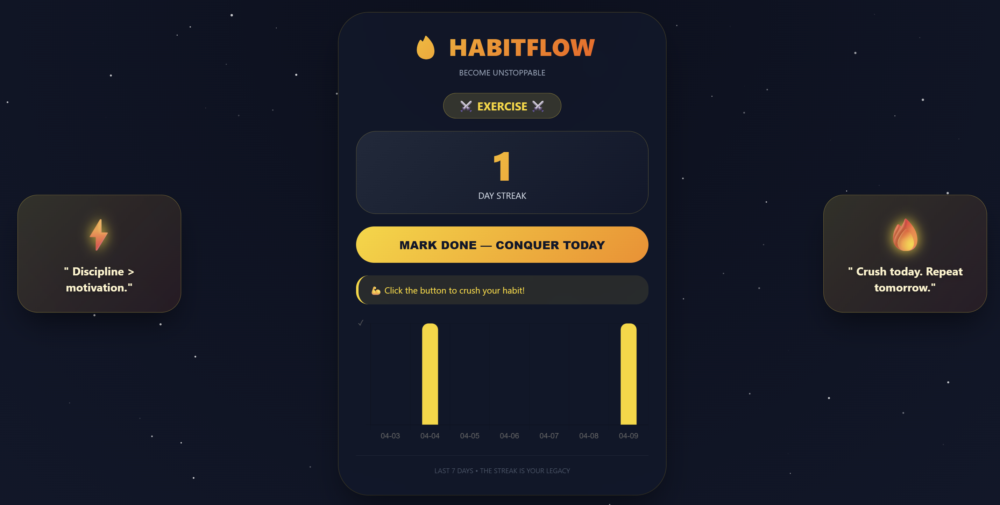

# HabitFlow

**One habit at a time. Become unstoppable.**

## Demo


## Product Context
- **End users:** People who want to build consistent daily habits
- **Problem:** Hard to stay motivated without tracking and encouragement
- **Solution:** Web dashboard + streak tracking + AI-powered motivation

## Features
-  Mark habit as done daily
-  Streak counter
-  7-day history chart
-  AI-generated motivational quotes
-  Mobile app (planned)
-  Multiple habits (planned)

## Usage
1. Open `http://<vm-ip>:42002`
2. Click **"Mark done for today"**
3. Watch your streak grow
4. Get motivated by epic quotes

## Deployment

### Requirements
- Ubuntu 24.04
- Docker & Docker Compose

### Steps
```bash
git clone https://github.com/inseeee/se-toolkit-hackathon.git
cd se-toolkit-hackathon
docker compose up --build -d